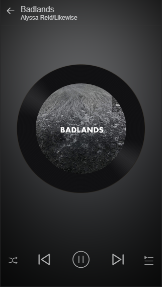
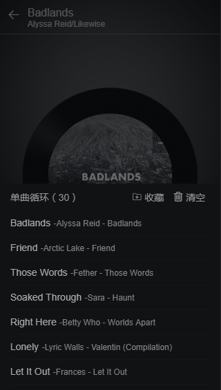
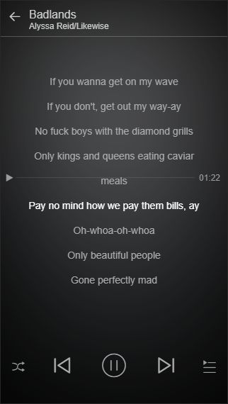

# vue-163-music
vue仿写网易云音乐,前端新手上路,请老司机多给点关怀和建议

过一段时间完善文档...代码不忍直视

[在线预览](http://39.108.214.107:8000)（因为用了css3的blur，移动端会很很很卡，预览建议用电脑的开发者模式的移动端视图. ）

## 效果图

### 内核样式

完成了内核样式和动画，及vuex的数据通信，可以切歌，拖动歌词，因为播放接口存在问题，所以内核的主要功能（播放+歌词根据播放内容滚动，进度条等没有完成）
